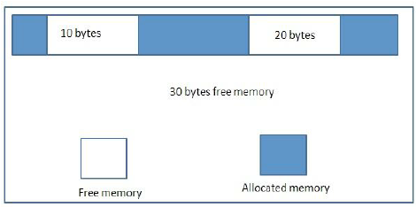

# Memory Pool Allocator

I built a somewhat safe memory pool allocator 
with Rust and the `libc` crate 
because i love crabs and memory safety

(Mozilla pls give me an internship i beg u)

    

### Background
**Dynamic Memory Allocation** is a programming technique
where a program allocates memory at runtime

System languages like **C**, **C++**, and **Rust** 
offer dynamic memory allocation through functions, 
operators, or smart pointer types
- **C** - C's standard library offers functions like
`malloc`, `calloc`, `realloc`, and `free`
- **C++** - C++ provides dynamic memory allocation via
operators like `new` and `delete`
- **Rust** - Rust's standard library handles dynamic
memory allocation through smart pointer types like
`Box`, `Rc`, and `Arc`

Dynamic Memory Allocation can cause multiple problems
- **Memory Fragmentation** - small blocks of unused 
memory are left unused, which results in very 
inefficient memory usage
- **Memory Leak** - Memory that was once
dynamically allocated was never freed
  - In C, this means that memory that was once allocated
  with `malloc`, `calloc`, or `realloc` is not
  freed with `free`
- **Overhead Performance** - Dynamically 
allocating and freeing memory to/from a heap 
is slower and has a high overhead performance

### Overview
A **memory allocator** is a memory management
strategy that creates a large block
of memory **(memory pool)** that is pre allocated
at runtime

A memory allocator is very useful and beneficial
as it solves the problems that are associated with
dynamic memory allocation
1. Memory allocators divide memory pools
into smaller chunks to manage memory more efficiently
   1. This reduces memory fragmentation by allocating
   and deallocating memory in a predictable manner,
   while dynamic memory allocation 
   allocates and deallocates memory 
   in an unpredictable manner
   

  <strong>Memory allocator diagram</strong>

    

